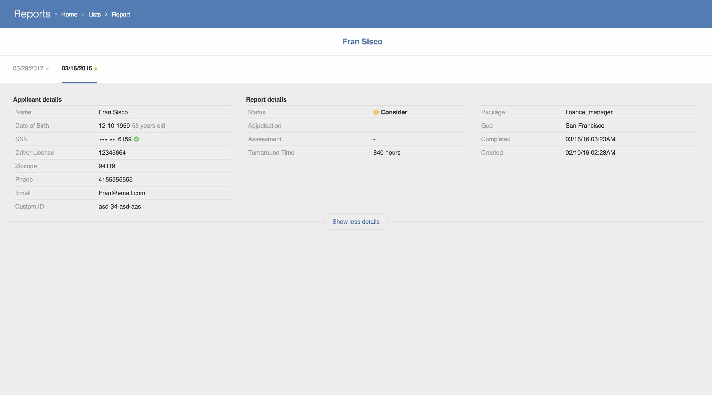

# Reports

* This project shows candidate reports grouped by status

* It was built using React and Redux

* Uses Presentational / Container architecture

* CSS follows BEM

`yarn install` to install dependencies

`yarn start` to run app in development mode

`yarn build` to generate prod build

## Home

## Lists

## Report
